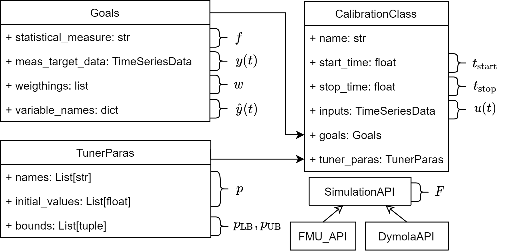

[](https://doi.org/10.21105/joss.03861)
[](https://ebc.pages.rwth-aachen.de/EBC_all/github_ci/AixCaliBuHA/master/pylint/pylint.html)
[](https://ebc.pages.rwth-aachen.de/EBC_all/github_ci/AixCaliBuHA/master/docs/index.html)
[](https://ebc.pages.rwth-aachen.de/EBC_all/github_ci/AixCaliBuHA/master/coverage)
[](https://opensource.org/licenses/MIT)
[](https://ebc.pages.rwth-aachen.de/EBC_all/github_ci/AixCaliBuHA/master/build/build.svg)

# AixCaliBuHA

**Aix** (from French Aix-la-Chapelle) 
**Cali**bration for **Bu**ilding and **H**V**A**C Systems

This framework automates the process of calibrating models used in Building
and HVAC Simulations.

# Key features
- Performing a **Sensitivity Analysis** to discover tuner parameters for the calibration
- **Calibration** of a given model based on the tuner parameters, the calibration classes and specified goals to evaluate the objective function of the underlying optimization

# Installation

To install, simply run
```
pip install aixcalibuha
```

If you encounter an error with the installation of `scikit-learn`, first install `scikit-learn` separately and then install `ebcpy`:

```
pip install scikit-learn
pip install aixcalibuha
```

If this still does not work, we refer to the troubleshooting section of `scikit-learn`: https://scikit-learn.org/stable/install.html#troubleshooting. Also check [issue 23](https://github.com/RWTH-EBC/ebcpy/issues/23) for updates.

In order to help development, install it as an egg:

```
git clone --recurse-submodules https://github.com/RWTH-EBC/AixCaliBuHA
pip install -e AixCaliBuHA
```

# Framework structure

The core idea and motivation of `AixCaliBuHA` is described in the [paper](https://joss.theoj.org/papers/10.21105/joss.03861).
The following image illustrates the overall toolchain automated by `AixCaliBuHA`.


At the core of `AixCaliBuHA` lays the definition of data types, that link the python data types to the underlying optimization problem and are used for all subsequent steps.
This image below illustrates this. For more information, check the [paper](paper/AixCaliBuHA_10.21105.joss.03861.pdf) and the subsequent section on how to get started.




# How to get started?
We differ this section into two parts. How to get started with the theory of calibration and how to get started with using this repo.

## How can I calibrate my model?
While we aim at automating most parts of a calibration process, you still have to specify the inputs and the methods you want to use.
We therefore recommend to:
1. Analyze the physical system and theoretical model you want to calibrate
2. Identify inputs and outputs of the system and model
3. Get to know your tuner parameters and how they affect your model
4. Plan your experiments and perform them
5. Learn about the methods provided for calibration (statistical measures (RMSE, etc.), optimization, ...)
6. **Always be critical** about the results of the process. If the model approach or the experiment is faulty, the calibration will perform accordingly. 

## How to start with AixCaliBuHA?
We have three services in place to help you with the setup of `AixCaliBuHA`. For the basics on using this repo, we recommend the Jupyter Notebook.
If you want to setup your calibration models (in Modelica) and quickly start your first calibration, we provide a guided setup.

### Jupyter Notebook
We recommend running our jupyter-notebook to be guided through a **helpful tutorial**.  
For this, run the following code:
```
# If jupyter is not already installed:
pip install jupyter
# Go into your ebcpy-folder (cd \path_to_\AixCaliBuHA) or change the to the absolute path of the tutorial.ipynb and run:
jupyter notebook AixCaliBuHA\examples\tutorial.ipynb
```

### Examples
Clone this repo and look at the examples\README.md file.
Here you will find several examples to execute.

### Visualization

We provide different plots to make the process of calibration clearer to you. We will go into detail on the different plots, what they tell you and how you can enable/disable them. We refer the plot names with the file names they get.

#### objective_plot:


**What do we see?** The solver in use was "scipy_differential_evolution" using the "best1bin" method. After around 200 iterations, the solver begins to converge. The last 150 itertions don't yield a far better solution, it is ok to stop the calibration here. You can do this using a `KeyboardInterrupt` / `STRG + C`.

**How can we enable/disable the plot?** Using the `show_plot=True` keyword argument (default is `True`)

#### tuner_parameter_plot:


**What do we see?** The variation of values of the tuner parameters together with their specified boundaries (red lines). The tuner parameters vary significantly in the first 200 iterations. At convergence the values obviously also converge.

**How can we enable/disable the plot?** Using the `show_plot=True` keyword argument (default is `True`)

#### tsd_plot: Created for two different classes - "stationary" and "Heat up"


**What do we see?** The measured and simulated trajectories of our selected goals. The grey part is not used for the evaluation of the objective function. As these values are `NaN`, matplotlib may interpolate linearly between the points, so don't worry if the trajectory is not logical in the grey area. Note that the inital values for the class "stationary" are not matching the initial values of the measured data. Even if the parameters are set properly, the objective would yield a bad result. In this case you have to adapt the inital values of your model directly in the Modelica code (see section "Best practices").

**How can we enable/disable the plot?** Using the `create_tsd_plot=True` keyword argument for showing it each iteration, the  `save_tsd_plot=True` for saving each of these plots. (Default is `True` and `False`, respectivly.)


#### tuner_parameter_intersection_plot:


**What do we see?** This plot is generated if you calibrate multiple classes **AND** different classes pyrtially have the same tuner parameters (an intersection of `tuner_paras`). In this case multiple "best" values arise for one tuner parameter. The plot shows the distribution of the tuner-parameters if an intersection is present. You will also be notified in the log file. In the case this plot appears, you have to decide which value to choose. If they differ greatly, you may want to either perform a sensitivity analysis to check which parameter has the biggest impact OR re-evaluate your modelling decisions. 

**How can we enable/disable the plot?** Using the `show_plot=True` keyword argument (default is `True`)

# How to cite AixCaliBuHA

Please use the following metadata to cite `AixCaliBuHA` in your research:

```
@article{Wüllhorst2022,
  doi = {10.21105/joss.03861},
  url = {https://doi.org/10.21105/joss.03861},
  year = {2022},
  publisher = {The Open Journal},
  volume = {7},
  number = {72},
  pages = {3861},
  author = {Fabian Wüllhorst and Thomas Storek and Philipp Mehrfeld and Dirk Müller},
  title = {AixCaliBuHA: Automated calibration of building and HVAC systems},
  journal = {Journal of Open Source Software}
}
```

# Documentation
Visit hour official [Documentation](https://ebc.pages.rwth-aachen.de/EBC_all/github_ci/AixCaliBuHA/master/docs).

# Problems?
Please [raise an issue here](https://github.com/RWTH-EBC/AixCaliBuHA/issues/new).
