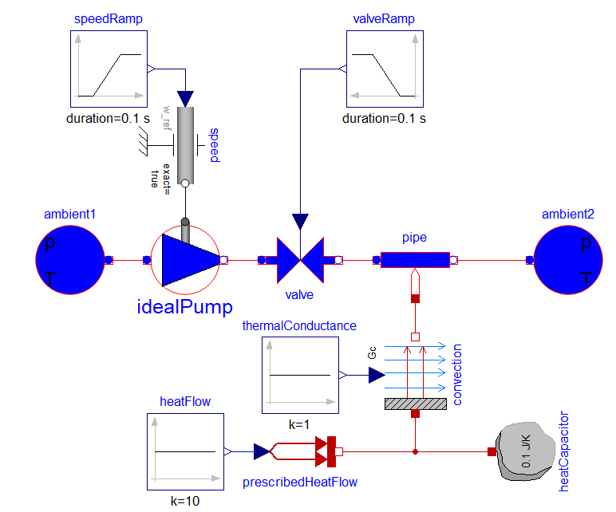

# Examples

This folder contains several example files which help with the understanding of AixCaliBuHA.

# Getting started

While these examples should run in any IDE, we advise using PyCharm.
To execute these examples, be sure to:

1. Create a clean environment of python 3.7 or 3.8. In Anaconda run: `conda create -n py38_ebcpy python=3.8`
2. Activate the environment in your terminal. In Anaconda run: `activate py38_ebcpy`
3. Clone the library using `git clone --recurse-submodules https://github.com/RWTH-EBC/AixCaliBuHA`
5. Install the library using `pip install -e AixCaliBuHA`

We have two models to show the calibration process for different components inside typical building and HVAC systems.

- **Example model A**: This model is of a heat pump system supplying heat to a room using a radiator. The models are based on the `AixLib`.

  
- **Example model B**: This model is of a pump and a valve from the Modelica Standard Library. 

  

Currently, example A runs only on windows. Example B runs on both linux and windows.
Additionally, you need Dymola installed for the first example of model A. If you don't have Dymola, just follow example B or skip the first example. It's not vital to understand this framework, it just helps to understand the energy system analysis prior to calibration.
To follow a specific example A or B, execute the first and second example for the case, for instance `e1_A`.
The examples 3-5 are written for both, so just alter the parameter in the `if __name__ == '__main__'` section, for instance `EXAMPLE = A` to `EXAMPLE = B`.

# What can I learn in the examples?

## `e1_A_energy_system_analysis.py` and `e1_B_energy_system_analysis.py`

1. Learn how to analyze the model of your energy system
2. Improve your `SimulationAPI` knowledge
3. Improve your skill-set on `TimeSeriesData`
4. Generate some measured data to later use in a calibration

## `e2_A_optimization_problem_definition.py` and `e2_B_optimization_problem_definition.py`

1. Learn how to formulate your calibration problem using our data_types
2. Get to know `TunerParas`
3. Get to know `Goals`
4. Get to know `CalibrationClass`
5. Learn how to merge multiple classes

## `e3_sensitivity_analysis_example.py`

1. Learn how to execute a sensitivity analysis
2. Learn how to automatically select sensitive tuner parameters

## `e4_calibration_example.py`

1. Learn the settings for a calibration
2. Learn how to use both Single- and MultiClassCalibration
3. Learn how to validate your calibration

## `e5_automated_process.py`

1. Learn how to run everything in one script

## `e6_multiprocessing_calibration_example.py`

1. Just as in e4, learn how to set up a calibration, this time while using multiprocessing
2. Install and use pandas==1.3.5 and tables==3.6.1
