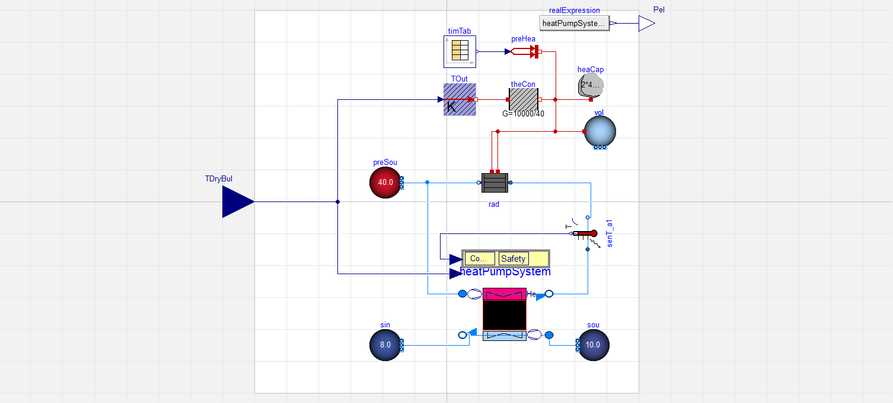

 # Example 1-A Energy system analysis
 Goals of this part of the examples:
 1. Learn how to analyze the model of your energy system
 2. Improve your `SimulationAPI` knowledge
 3. Improve your skill-set on `TimeSeriesData`
 4. Generate some measured data to later use in a calibration
 Start by importing all relevant packages
```python
import pathlib
import matplotlib.pyplot as plt
```
 Imports from ebcpy
```python
from ebcpy import DymolaAPI, TimeSeriesData
```
 Please define the missing TODOs in the section below according to the docstrings.
```python
"""
Arguments of this example:

:param str examples_dir:
    Path to the examples folder of AixCaliBuHA
:param str aixlib_mo:
    Path to the package.mo of the AixLib.
    This example was tested for AixLib version 1.0.0.
:param str cd:
    Path in which to store the output.
    Default is the examples\results folder
:param bool with_plot:
    Show the plot at the end of the script. Default is True.
"""
examples_dir = "TODO: Add a valid input according to the docstring above"
aixlib_mo = "TODO: Add a valid input according to the docstring above"
cd = None
with_plot = True
```
 General settings
```python
if cd is None:
    cd = pathlib.Path(examples_dir).joinpath("results")
else:
    cd = pathlib.Path(cd)
examples_dir = pathlib.Path(examples_dir)
aixcalibuha_mo = examples_dir.joinpath("model", "AixCaliBuHAExamples.mo")
```
 ## System analysis
 The best way to analyze the model which we later want to calibrate
 is to either pause here (set a debug point) or open the models in a GUI (OpenModelica, Dymola, o.s.).
 The model looks like this (only works in markdown and jupyter versions): 
 Click through the system and subsystem to understand what happens in the model.
 As you may have guessed, the analysis of an energy system can be quite complex
 and is thus hard to automize. Before using AixCaliBuHA, you should understand
 what happens in your system. If you have questions regarding modeling assumptions,
 ask e.g. the model developers of the library you are using,
 in this case the AixLib.

 Start by setting up the Dymola-API. For more info, see the examples in ebcpy.
```python
dym_api = DymolaAPI(
    model_name="AixCaliBuHAExamples.HeatPumpSystemCalibration",
    cd=cd,
    packages=[
        aixlib_mo,
        aixcalibuha_mo
    ],
    show_window=True,
    equidistant_output=False
)
print("Pausing for analysis. Set the break point here if you like!")
```
 ## Data generation
 We want to exemplify the process of getting experimental data using
 the model we later want to calibrate.
 This is a good example for two reasons:
 1. You really know the optimal parameters
 2. We don't have to deal with measurement noise etc.

 For this example, we simulate 1 h with a 1 s sampling rate.
 For further simulation help, check out the ebcpy examples.
```python
dym_api.set_sim_setup({
    "stop_time": 3600,
    "output_interval": 10
})
file_path = dym_api.simulate(
)
```
 ## Data analysis
 Now let's analyze the data we've generated.
 Open the file first and extract variables of interest.
 As the model concerns a heat pump, we are most interested in
 variables relevant for heat pumps. This could be the
 electrical power consumption (Pel) and room comfort (TAir)
 supplied by the heat pump.
 When looking at the model, we have one input:
 TDryBulSource.y, which represents the outdoor air temperature.
 This input is important for heat pumps, as efficiency mainly depends
 on source temperatures, and the model is of an air source heat pump.
 We thus also extract this input for our data analysis.
```python
tsd = TimeSeriesData(file_path)
tsd = tsd[["Pel", "TAir", "TDryBulSource.y"]]
```
 Let's check the frequency of the data to see if our 1 s sampling rate
 was correctly applied:
```python
print("Simulation had index-frequency of %s with "
      "standard deviation of %s" % tsd.frequency)
```
 Due to state events (see Modelica help for more info on that),
 our data is not equally sampled.
 To later match the simulation data with a fixed output interval (parameter output_interval),
 we have to process the data further.
 To do this, we have the function 'clean_and_space_equally' in ebcpy's TimeSeriesData.
 It only works on datetime indexes, hence we convert the data first:
 Note: Real measured data would already contain DateTimeIndex anyways.
```python
tsd.to_datetime_index()
```
 Save a copy to check if our resampling induces data loss:
```python
tsd_reference = tsd.copy()
```
 Apply the function
```python
tsd.clean_and_space_equally(desired_freq="10s")
print("Simulation now has index-frequency of %s with "
      "standard deviation of %s" % tsd.frequency)
```
 Let's check if the sampling changed our measured data and
 plot all relevant variable to analyze our system:
```python
fig, ax = plt.subplots(3, 1, sharex=True)
ax[0].plot(tsd_reference['TDryBulSource.y'] - 273.15, color="blue", label="Reference")
ax[0].plot(tsd['TDryBulSource.y'] - 273.15, color="red", label="Resampled")
ax[0].set_ylabel("$T_\mathrm{Outdoor,Air}$ in °C")
ax[1].plot(tsd_reference['Pel'] / 1000, color="blue", label="Reference")
ax[1].plot(tsd['Pel'] / 1000, color="red", label="Resampled")
ax[1].set_ylabel("$P_\mathrm{el}$ in kW")
ax[2].plot(tsd_reference['TAir'] - 273.15, color="blue", label="Reference")
ax[2].plot(tsd['TAir'] - 273.15, color="red", label="Resampled")
ax[2].set_ylabel("$T_\mathrm{Air}$ in °C")
ax[2].set_xlabel("Time in s")
plt.legend()
if with_plot:
    plt.show()
```
 ### What and why do we see this?
 Looking at the first plot, we see a very frequent ambient air temperature
 sinus-wave switching between -10 and 10 °C every other minute. That's obviously
 none-sense, but better visualises the influence of the outdoor air temperature
 on the room temperature (third plot).
 The second plot shows how the heat pump is turned on four times,
 resulting in an increase in room temperature. As soon as the hysteresis limit
 of 22 °C room temperature is reached, the heat pump is turned of again.
 Only at initialization this limit exceeds, as the minimal run time of the
 heat pump is enabled as a safety control.
 ### What does this mean for our calibration?
 This means we've understood the basic physics behind our system.
 In this example, we've changed the following four parameters:
 - Volume of room (vol.V = 56 m³)
 - Thermal conductance to the ambient / wall insulation (theCon.G = 356 W/K)
 - Heat capacity of walls in the room (heaCap.C = 90000 J/K)
 - Exponent of radiator heat transfer (rad.n = 1.7)
 If any meaning of said parameters is unclear, look up the models used in
 this example. As a take-away note: We focus on the building and heat transfer physics,
 less on the heat pump or HVAC components.
 ## Data saving
 In order to use this data in the other examples for the calibration, we have to save it.
```python
tsd_inputs = tsd[["TDryBulSource.y"]]
tsd_measurements = tsd[["Pel", "TAir"]]
tsd_inputs.save(examples_dir.joinpath("data", "measured_input_data.hdf"), key="example")
tsd_measurements.save(examples_dir.joinpath("data", "measured_target_data.hdf"), key="example")
print("Saved data under", examples_dir.joinpath("data"))
```
