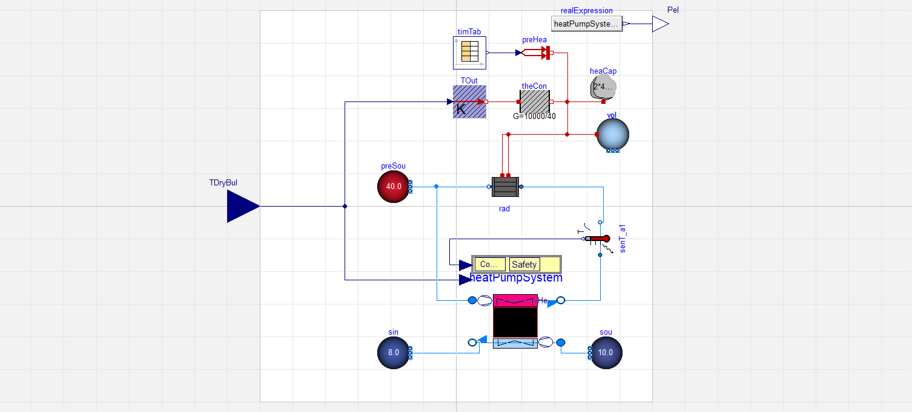

 # Example 1-B Energy system analysis
 Goals of this part of the examples:
 1. Learn how to analyze the model of your energy system
 2. Improve your `SimulationAPI` knowledge
 3. Improve your skill-set on `TimeSeriesData`
 4. Generate some measured data to later use in a calibration

 Start by importing all relevant packages
```python
import pathlib
import matplotlib.pyplot as plt
```
 Please define the missing TODOs in the section below according to the docstrings.
```python
"""
Arguments of this example:

:param [pathlib.Path, str] examples_dir:
    Path to the examples folder of AixCaliBuHA
:param bool with_plot:
    Show the plot at the end of the script. Default is True.
"""
examples_dir = "TODO: Add a valid input according to the docstring above"
with_plot = True
```
 ## System analysis
 The best way to analyze the model which we later want to calibrate
 is to open the models in a GUI (OpenModelica, fmpy, Dymola, o.s.).
 The model looks like this (only works in markdown and jupyter versions): 
 Click through the system and subsystem to understand what happens in the model.
 As you may have guessed, the analysis of an energy system can be quite complex
 and is thus hard to automize. Before using AixCaliBuHA, you should understand
 what happens in your system. If you have questions regarding modeling assumptions,
 ask e.g. the model developers of the library you are using,
 in this case the Modelica Standard Library.

 Start by setting up the FMU-API. For more info, see the examples in ebcpy.
 As we will use the API in each example, we've created a util function
 under examples\__init__.py
```python
from examples import setup_fmu
fmu_api = setup_fmu(example="B", examples_dir=examples_dir)
```
 ## Data generation
 We want to exemplify the process of getting experimental data using
 the model we later want to calibrate.
 This is a good example for two reasons:
 1. You really know the optimal parameters
 2. We don't have to deal with measurement noise etc.

 For this example, we simulate 10 s with a 10 ms sampling rate.
 For further simulation help, check out the ebcpy examples.
```python
fmu_api.set_sim_setup({
    "stop_time": 10,
    "output_interval": 0.01
})
```
 Let's assume the real values to be:
 speedRamp.duration = 0.432 and valveRamp.duration = 2.5423
```python
parameters = {"speedRamp.duration": 0.432, "valveRamp.duration": 2.5423}
```
 Also set the outputs we may be interested in. These choices are not
 necessarily the most important quantities in the given model.
 But as we focus on dynamic calibration, temperature trajectories
 are a good example.
```python
fmu_api.result_names = ["heatCapacitor.T", "pipe.T"]
```
 Perform the simulation
```python
tsd = fmu_api.simulate(parameters=parameters)
```
 ## Data analysis
 Check the frequency of the data:
```python
print("Simulation had index-frequency of %s with "
      "standard deviation of %s" % tsd.frequency)
```
 Let's look at the data we've created:
```python
fig, ax = plt.subplots(1, 1, sharex=True)
ax.plot(tsd['heatCapacitor.T'] - 273.15, label="Capacity")
ax.plot(tsd['pipe.T'] - 273.15, label="Pipe")
ax.set_ylabel("Temperature in °C")
ax.set_xlabel("Time in s")
ax.legend()
if with_plot:
    plt.show()
```
 ### What do we see?
 Only looking at the plots, we see two temperature trajectories
 of the pipe and the capacity in the model. Both rise until 1 s
 and after 1 s converge against a static value.
 ### Why do we see this?
 To answer this, you have to understand the model.
 The model heat ups the heat capacity with a constant heat flow
 of 10 W.
 This capacity is connected to a pipe with a fixed resistance.
 A fluid is passing through this pipe with a cooler temperature than
 the capacity. Hence, heat moves from the capacity to the pipe depending
 mostly on the mass flow rate of the fluid. The latter depends on two
 things: The speed of the pump and the opening of the valve.
 We influence both values via our tuner parameters we've defined above.
 ### What does this mean for our calibration?
 Both parameters influence the ramp input of the pump and the valve.
 A large duration for the ramps means less speed and opening and
 thus less flow rate leading to warmer pipe and capacity temperatures
 Small values indicate the opposite.
 ## Data saving
 In order to use this data in the other examples, we have to save it.
 Also, as data is typically generated using datetime stamps and different naming,
 let's change some names and time index to ensure a realistic scenario:
```python
tsd = tsd.rename(columns={"pipe.T": "TPipe", "heatCapacitor.T": "TCapacity"})
tsd.to_datetime_index()
tsd.save(pathlib.Path(examples_dir).joinpath("data", "PumpAndValve.hdf"), key="examples")
print("Saved data under", pathlib.Path(examples_dir).joinpath("data"))
```
